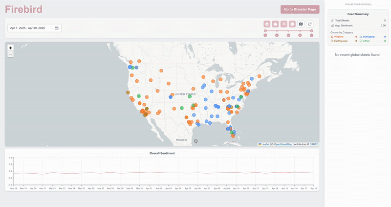

# Firebird 

**Firebird** is the frontend application for the Firebird project. Built with Next.js and React, 
it provides an interactive interface for users to visualize potential disaster events 
(wildfires, earthquakes, hurricanes) and related sentiment trends detected from the 
Bluesky social platform.

This client application fetches processed data from Firestore 
(populated by the [go-server backend](https://github.com/brayanMuniz/go-firebird)) and presents it through maps, charts, tables, and skeet feeds.

[Live Demo](https://firebird-ivory.vercel.app/) 

## The Firebird Motivation: Unlocking Social Signals for Disaster Awareness

The problem: During rapidly evolving events like wildfires or earthquakes, information is critical, 
but official channels can take time to disseminate. Meanwhile, social media platforms like Bluesky 
become a real-time stream of eyewitness accounts and public sentiment. 
However, extracting meaningful, actionable insights from this vast, 
unstructured data is a significant challenge.

The solution: Firebird. We built Firebird to specifically address this challenge by:
1.  **Focusing** on disaster-relevant feeds and keywords on Bluesky.
2.  **Analyzing** not just what is said, but *how* it's said through sentiment analysis.
3.  **Visualizing** these insights geographically and over time through an intuitive interface.
Firebird aims to transform the raw, often overwhelming, flow of social data into a clearer, 
more actionable picture of potential real-world events, offering a unique layer of situational awareness.

## Key Features

*   **Interactive Map Display:** Visualizes disaster locations and potentially hospital data using Leaflet.
*   **Disaster Overview:** Presents a list or table of detected disasters with key details.
*   **Skeet Feed:** Shows relevant skeets associated with selected disasters or locations.
*   **Sentiment Visualization:** Displays sentiment trends over time using charts.
*   **Data Filtering:** Allows users to filter disasters/locations by category, sentiment range, and date.
*   **Responsive Design:** Aims for a good user experience across different screen sizes using Tailwind CSS.
*   **Client-Side Caching:** Implements strategies to cache data like locations and skeets to improve performance.

## Tech Stack

*   **Framework:** Next.js (React)
*   **Styling:** Tailwind CSS
*   **Mapping:** Leaflet
*   **Charting:** Recharts 
*   **State Management:** React Hooks (Context API, `useState`, `useEffect`, `useMemo`, `useCallback`)
*   **Data Fetching:** Firebase SDK (for Firestore), `fetch` API
*   **Date/Time:** Moment.js
*   **Deployment:** Vercel
